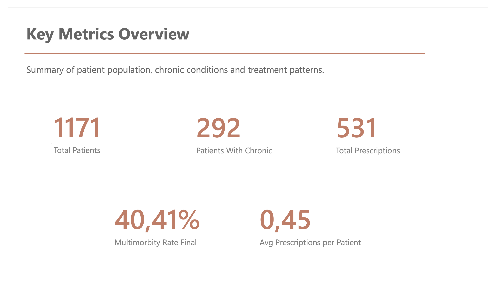
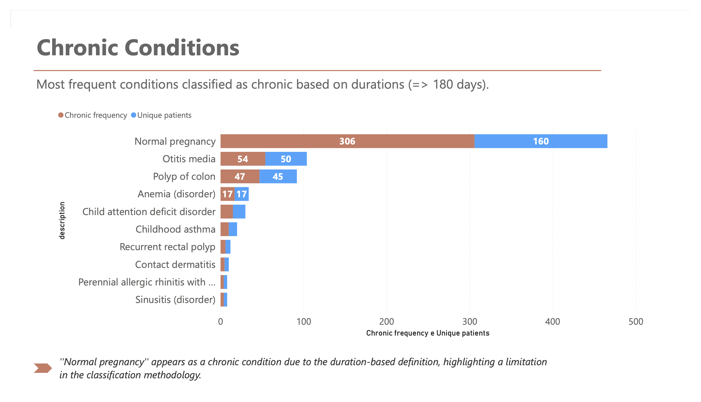
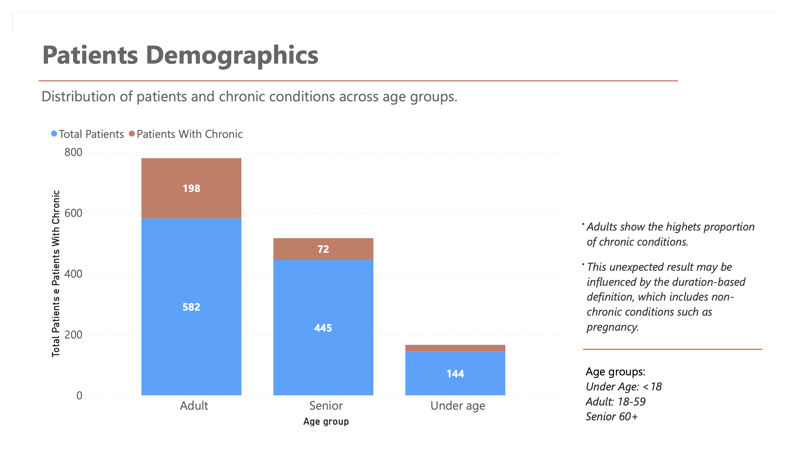
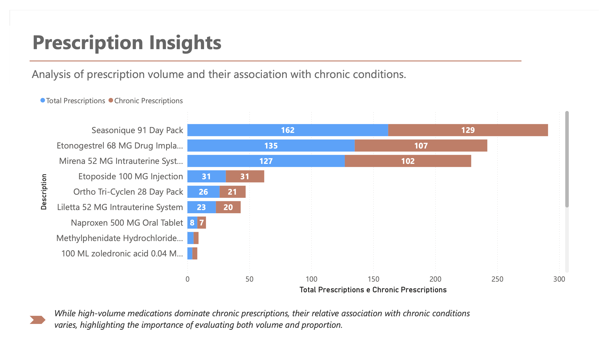

# Healthcare Data Analysis: Chronic Conditions & Treatment Patterns

## Overview

This project explores patient data to investigate the prevalence of chronic conditions, demographic patterns, and prescription behaviors. The analysis focuses on identifying meaningful relationships between long-term conditions, patient age groups, and treatment patterns.

---

## Objectives

- Identify the most frequent chronic conditions
- Analyze the distribution of chronic conditions across age groups
- Measure multimorbidity among patients
- Evaluate prescription patterns and their association with chronic conditions

---

## Tools & Technologies

- SQL (data exploration and analysis)
- Power BI (data visualization and dashboard design)
- SQLite (local database used for analysis)
- Git
- GitHub

---

## Dashboard Preview

### Key Metrics Overview

### Chronic Conditions Analysis

### Patient Demographics

### Prescription Insights

---

## Key Insights

- **Adults show the highest proportion of chronic conditions**, suggesting that chronic care demand is not limited to older populations and may require earlier intervention strategies.

- **Pregnancy appears as the most frequent "chronic condition"**, highlighting a limitation of defining chronicity based solely on duration (≥180 days).

- **Approximately 40% of patients with chronic conditions present multimorbidity**, indicating a high level of clinical complexity.

- **High prescription volume does not necessarily indicate association with chronic conditions**, emphasizing the need to analyze both frequency and patient context.

---

## Limitations

- Chronic conditions were defined based on duration (≥180 days), which may misclassify certain conditions.
- The dataset may contain biases that influence demographic distributions.

---

## 🔗 Interactive Dashboard

The interactive dashboard is available in the repository as a .pbix file.

---

## Project Structure
healthcare-data-analysis/
├── images/
├── dashboard/
├── sql/
└── README.md

---

## About This Project
This project was developed as part of a data analytics portfolio to demonstrate skills in SQL, data modeling, and dashboard design, with a focus on transforming data into actionable insights.